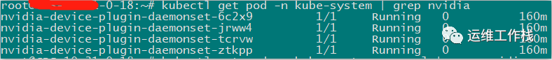
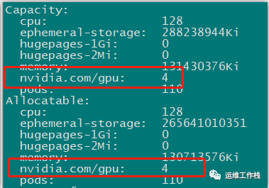
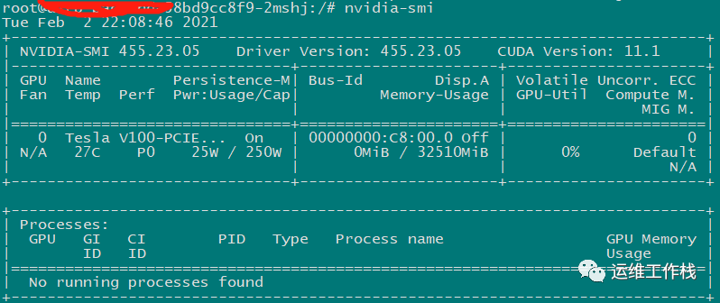

# K8S GPU调度

最近公司有项目想在 k8s 集群中运行 GPU 任务，于是研究了一下。下面是部署的步骤。

#### 1\. 首先得有一个可以运行的 k8s 集群. 集群部署参考 kubeadm安装k8s

#### 2\. 准备 GPU 节点

2.1 安装驱动

```bash
curl -fsSL https://mirrors.aliyun.com/nvidia-cuda/ubuntu1804/x86_64/7fa2af80.pub | sudoapt-key add -
echo"deb https://mirrors.aliyun.com/nvidia-cuda/ubuntu1804/x86_64/ ./"> /etc/apt/sources.list.d/cuda.list
 
apt-get update
apt-get install-y cuda-drivers-455
```

2.2 安装 `nvidia-docker2`

<!-- Note that you need to install the nvidia-docker2 package and not the nvidia-container-toolkit. This is because the new --gpus options hasn't reached kubernetes yet -->

```bash
distribution=$(. /etc/os-release;echo$ID$VERSION_ID)
curl -s -L https://nvidia.github.io/nvidia-docker/gpgkey| sudoapt-key add -
curl -s -L https://nvidia.github.io/nvidia-docker/$distribution/nvidia-docker.list | sudotee/etc/apt/sources.list.d/nvidia-docker.list
 
sudoapt-get update && sudoapt-get install-y nvidia-docker2
 

{
    "default-runtime": "nvidia",
    "runtimes": {
        "nvidia": {
            "path": "/usr/bin/nvidia-container-runtime",
            "runtimeArgs": []
        }
    }
}
 

sudosystemctl restart docker
```

2.3 在 k8s 集群中安装 `nvidia-device-plugin` 使集群支持 GPU

```bash
kubectl create -f https://raw.githubusercontent.com/NVIDIA/k8s-device-plugin/v0.7.3/nvidia-device-plugin.yml
```

`nvidia-device-plugin` 做三件事情

- Expose the number of GPUs on each nodes of your cluster
- Keep track of the health of your GPUs
- Run GPU enabled containers in your Kubernetes cluster.

###### 之后把节点加入 k8s 集群

###### 以上步骤成功完成之后, 运行以下命令能看到类似下面图片中的内容说明插件安装好了

```bash
kubectl get pod --all-namespaces | grepnvidia
kubectl describe node 10.31.0.17
```





#### 3\. 运行 GPU Jobs

```bash
apiVersion: v1
kind: Pod
metadata:
  name: gpu-pod
spec:
  containers:
    - name: cuda-container
      image: nvidia/cuda:9.0-devel
      resources:
        limits:
          nvidia.com/gpu: 2 
    - name: digits-container
      image: nvidia/digits:6.0
      resources:
        limits:
          nvidia.com/gpu: 2
```

```bash
kubectl apply -f nvidia-gpu-demo.yaml
 
kubectl exec-it xxx-76dd5bd849-hlmdr -- bash
```



以上就简单实现了 k8s 调度 GPU 任务。