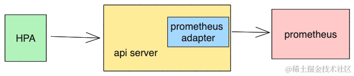
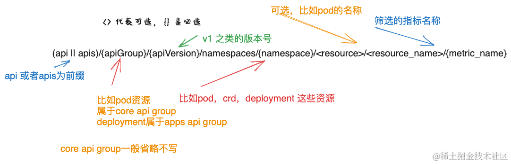

# 自动扩缩容HPA原理及adapter配置详解

## 自动扩缩容架构图

[]

我们先来看一下自动扩缩容的原理，在k8s中HPA这个模块的逻辑会定时请求api server 获取相应的pod或者CRD或者其他资源的指标信息，这些指标信息是用户创建HPA的yaml配置文件时指定的。

api server收到请求后，根据请求的api group，api version 转发给内部的api service服务进行处理，当我们想让k8s借用prometheus的相关指标进行扩缩容时，就需要在集群里用api service的方式安装prometheus adapter，它会将发往api server的请求经过包装，转发到prometheus服务器获取对应指标信息，然后将结果经过封装返回给客户端即HPA模块。HPA模块收到指标后，在根据自身配置文件中的target值判断是否需要进行自动扩缩容。

### api server 处理请求的方式

既然提到了prometheus adapter是以api service 方式安装到k8s集群中的，我再对api server的架构已经处理请求的方式再阐述下。

api server 处理请求的方式是链式的，你可以简单的理解为api server里有多个http server ，当某个请求的路径不属于某个http server处理范畴内的话，会将这个请求委托给下一个http server进行处理。同时，k8s允许用户自定义api service作为http server，prometheus adapter 就是一个自定义的api service。

#### api server 请求路径格式

向api server发送http请求，请求格式是按一定规则进行组装的，我主要查看了HPA模块源码，所以拿这块去举例，hpa发往api server的请求是将api version和api group 以及要请求资源的命名空间，资源名拼接到一起组成的路径。如下:

[]

不同的HPA指标类型这个路径的拼接会有所不同(下面会详细讲到)，但是整体的api风格是和这个一致的。

当HPA在向api server发送请求的时候则是根据不同的扩缩容指标类型选择了不同的api group 去发送请求。

> ❗️❗️📢 注意，这里HPA选择的api group是k8s这部分代码已经固定好了的，所以prometheus adapter在以api service安装时指定的api group 需要和这里吻合。目前针对指标类型，HPA会从metrics.k8s.io, customer.metrics.k8s.io, external.metrics.k8s.io这3个api group种选取对应的group。

## HPA 扩缩容的4种指标类型

接下来，我们来详细看下，HPA扩缩容的4种指标类型。

### Pods

先看第一种pods类型，它表示的是由pod产生的指标， 其在HPA声明的配置yaml文件里写法如下，

```yaml
apiVersion: autoscaling/v2
kind: HorizontalPodAutoscaler
metadata:
    name: sample-app
    namespace: default
spec:
    maxReplicas: 10
    minReplicas: 2
    metrics:
      - pods:
           metric:
              name: http_requests
              selector:
                matchLabels:
                  <label-key>: <label-value>
           target:
              averageValue: 500m
              type: AverageValue
        type: Pods
scaleTargetRef:
    apiVersion: apps/v1
    kind: Deployment
    name: sample-app
```

可以看到spec.metrics.type 值为pods类型，HPA的pods 指标类型 是指pod这个资源对象产生的指标，其中定义了指标名为http\_requests，最终发往api server的url path如下所示，

```shell
/apis/custom.metrics.k8s.io/v1beta1/namespaces/default/pods/*/http_requests?labelSelector=<label-key>=<label-value>
```

api server 收到这个请求后会将请求转发给prometheus adapter，那么prometheus adapter 又是如何将http\_requests 与具体的prometheus中的指标对应起来的呢？

prometheus adapter在启动的时候我们会配置一个规则配置文件，在这个文件定义了这个映射关系，下面是这针这种类型的指标配置规则部分，

```yaml
rules:
- seriesQuery: 'http_requests_total{}'
  resources:
    overrides:
      kubernetes_namespace: {resource: "namespace"}
      kubernetes_pod_name: {resource: "pods"}
  name:
    matches: "http_requests_total"
    as: "http_requests"
  metricsQuery: 'sum(rate(<<.Series>>{<<.LabelMatchers>>}[2m])) by (<<.GroupBy>>)'
```

我们将hpa配置文件和发往api server的请求以及prometheus adapter的规则文件结合起来，看看prometheus adapter 规则文件里那些模板变量的含义。

首先是hpa的配置文件中指定了metric.name是http\_requests，http\_requests在prometheus adapter的配置文件里是将prometheus的http\_requests\_total与之对应了起来，并且从规则配置文件的resources.overrides 配置中可以发现namespace和pods资源在指标http\_requests\_total中会有kubernetes\_namespace和kubernetes\_pod\_name标签与之对应，这层关系其实主要是为了metricsQuery 中模板变量的替换。

metricsQuery 中 **<<.Series>>** 其实就是seriesQuery这部分。

**<<.LabelMatchers>>** 是筛选指标时的标签，在hpa里面我们指定了metric.selector，发往api server的请求里的参数labelSelector就会替代<<.LabelMatchers>>模板变量，同时发往api server请求中的namespace的值也会写到<<.LabelMatchers>>中，并且namespace的对应标签名就是resources.overrides中定义的kubernetes\_namespace。

**<<.GroupBy>>** 变量在这里会将k8s的resource资源类型作为分组的维度，并且在这个场景下，在发往api server的请求中，k8s的资源是pods类型，而pods类型在指标中的标签名是kubernetes\_pod\_name。

所以最终，在prometheus 中进行查询时执行的promql语句为,

```shell
sum(rate(http_requests_total{"kubernetes_namespace":"default","<label-key>":"<label-value>"}[2m])) by (kubernetes_pod_name)
```

### Object

在看了pods类型的hpa指标后，我们再来看看Object类型的指标是如何配置的，因为在k8s里资源类型除了pod类型，还有其他类型，所以如果由其他资源类型产生的指标，则由Object来表示。

先看下hpa的yaml配置文件是如何写的。

```yaml
apiVersion: autoscaling/v2
kind: HorizontalPodAutoscaler
metadata:
    name: sample-app
    namespace: default
spec:
    maxReplicas: 10
    minReplicas: 2
    metrics:
     - object:  
        metric:  
          name: requests-per-second  
        describedObject:  
          apiVersion: extensions/v1beta1  
          kind: Ingress  
          name: main-route  
        target:  
          type: Value  
          value: 2k
       type: Object 
scaleTargetRef:
    apiVersion: apps/v1
    kind: Deployment
    name: sample-app
```

发往api server的请求格式如下

```shell
/apis/custom.metrics.k8s.io/v1beta1/namespaces/default/ingress/main-route/requests-per-second
```

prometheus adapter配置此类规则和Pods类型类似，模板变量解析方式也是类似，唯一有点不一样的是此时的<<.GroupBy>> 模板变量会被ingress/main-route 也就是资源名加上资源示例名替代。

### Resource, ContainerResource

接着看一下hpa中的Resource类型的指标配置，它表示对pod的cpu或者内存值来进行扩缩容，本质上可以用Pods 类型的配置来代替这部分配置，那为什么还有Resource类型呢？因为Resource出来的时候还没有Pods 类型。

Kubernetes 1.20 在 HorizontalPodAutoscaler (HPA) 中引入了 `ContainerResource` 类型指标，不论是Resource还是ContainerResource都只能对cpu和内存这两个维度进行监控，它们的区别如下，

Resource 计算pod的资源使用率是

```shell
sum{每个容器的资源使用量} / sum{每个容器的资源请求}
```

但是一个pod有多个容器，可能会出现单个容器资源使用率高，但是平均下来每个容器资源使用率低的情况，而ContainerResource 则能够指定以pod中的哪个容器拿来计算扩容指标，能够提供更准确的扩容机制。

ContainerResource在hpa的yaml配置文件中配置如下,其中container标签指明了容器名称。

```yaml
type: ContainerResource
containerResource:
  name: cpu
  container: application
  target:
    type: Utilization
    averageUtilization: 60
```

而Resource类型的扩容指标则是针对pod中所有容器计算指标，

```yaml
type: Resource
resource:
  name: cpu
  target:
    type: Utilization
    averageUtilization: 60
```

它们发往api server 的请求格式如下

```shell
/apis/metrics.k8s.io/v1beta1/namespaces/default/pods
```

> 注意，这里的配置文件没有加上selector，实际上我们平时写配置文件的时候肯定是有selector的，所以发往api server的请求也会有selector的参数

prometheus adapter 在收到这个请求后，会将对应的pod的cpu和内存信息全部返回，然后k8s的hpa模块筛选其需要用到的部分，像ContainerResource就会筛选返回结果中和container标签值代表的容器名称一样的指标进行计算。

prometheus adapter针对此类型的指标规则配置如下， 其中的containerLabel 表明了指标中容器名称是用哪个标签表示的，此时的<<.GroupBy>>模板变量 会由pod资源名称和容器名标签两个维度替代。

> 以下是prometheus adapter官方给出的配置模版，自己配置的时候需要改掉实际查询的指标名已经标签名等。

```yaml
"resourceRules":  
  "cpu":  
    "containerLabel": "container"  
    "containerQuery": |  
      sum by (<<.GroupBy>>) (  
        irate (  
            container_cpu_usage_seconds_total{<<.LabelMatchers>>,container!="",pod!=""}[4m]  
        )  
      )  
    "nodeQuery": |  
      sum by (<<.GroupBy>>) (  
        irate(  
            node_cpu_usage_seconds_total{<<.LabelMatchers>>}[4m]  
        )  
      )  
    "resources":  
      "overrides":  
        "namespace":  
          "resource": "namespace"  
        "node":  
          "resource": "node"  
        "pod":  
          "resource": "pod"  
  "memory":  
    "containerLabel": "container"  
    "containerQuery": |  
      sum by (<<.GroupBy>>) (  
        container_memory_working_set_bytes{<<.LabelMatchers>>,container!="",pod!=""}  
      )  
    "nodeQuery": |  
      sum by (<<.GroupBy>>) (  
        node_memory_working_set_bytes{<<.LabelMatchers>>}  
      )  
    "resources":  
      "overrides":  
        "node":  
          "resource": "node"  
        "namespace":  
          "resource": "namespace"  
        "pod":  
          "resource": "pod"  
  "window": "5m"
```

### External

最后，我们来看下external 类型的扩容指标如何配置，上面讲到的hpa 扩缩容指标类型都是在k8s集群里产生的指标，它们都限定在了一个namespace里面，除此以外，hpa模块还允许配置第三方的指标类型，比如集群外部的消息队列产生的指标，这类型的指标被称作External类型。 在hpa里配置案例如下，

```yaml
type: External  
external:  
    metric:  
        name: queue_messages_cnt  
        selector:  
            matchLabels:  
                app: "lanpangzi"  
        # External指标类型下只支持Value和AverageValue类型的目标值  
    target:  
        type: AverageValue  
        averageValue: 30
```

发往api server的请求格式如下

```shell
/apis/external.metrics.k8s.io/v1beta1/namespaces/default/queue_messages_cnt
```

由于外部指标和namespace无关，所以在配置prometheus adapter的规则配置文件的时候，指定下指标是namespace无关的。

```yaml
externalRules:  
- seriesQuery: 'queue_messages_cnt'  
resources:  
    namespaced: false  
name:  
    matches: 'queue_messages_cnt' 
    as: 'queue_messages_cnt'  
metricsQuery: avg(<<.Series>>{<<.LabelMatchers>>})
```

## 总结

探索HPA配置的含义过程中，其实可以发现k8s在针对HPA扩容依据的拓展方式上，就是规定了3组api group(metrics.k8s.io,external.metrics.k8s.io,custom.metrics.k8s.io)，并且用基本一致的http请求，让第三方(prometheus adapter)在声明为api service 的时候指定为对应的api group，然后解析请求路径和参数来进而对prometheus查询 即完成了对HPA扩容指标的查询。

关于prometheus adapter更多的配置案例建议直接看prometheus adapter的doc目录下的示例。