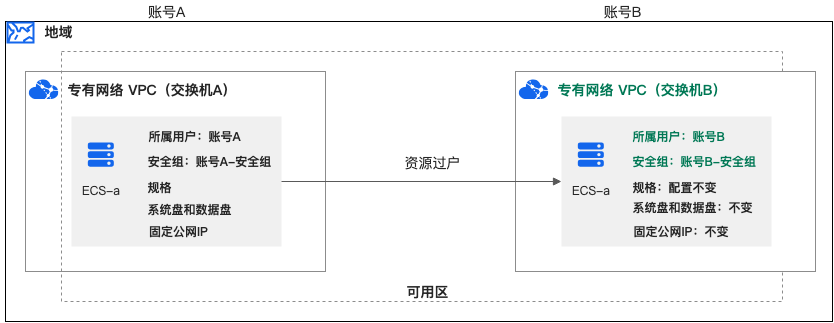

# ECS 迁移

最简单的方式是 ECS 过户，不过这里有一些限制，如果原账号是个人账号，那么目标账号无限制。如果原账号是企业账号，则指定过户给相同实名认证的企业账号。

具体操作步骤可以参考官方文档 [ECS过户](https://help.aliyun.com/zh/ecs/user-guide/how-to-cross-account-transfer-migration-ecs-instance) 进行操作。

本文重点介绍使用自定义镜像迁移服务器，以及创建新的空白服务器迁移服务。

## 服务器架构图

## 创建自定义镜像

如果服务器较少，或者服务器环境安装配置复杂，不想再重新安装，那么可以使用自定义镜像进行迁移。

1. 首先在原 ECS 的实例详情中，找到 “创建自定义镜像”，点击创建

2. 共享自定义镜像

将自定义镜像共享给目标账号，需要注意的是，镜像只能在相同的区域共享，如果想跨区域共享，则需要使用镜像复制，将镜像复制到目标区域，然后再共享给新账号。

3. 创建实例

在新账号接收共享镜像，然后创建 ECS 实例，创建时选择该自定义镜像进行创建。

## 使用标准镜像创建

1. 可以批量创建 ECS 实例，使用标准镜像进行创建。

2. 创建成功后考虑安装像 ansible 这样的工具进行批量配置环境。

## 参考资料

- [ECS过户](https://help.aliyun.com/zh/ecs/user-guide/how-to-cross-account-transfer-migration-ecs-instance)